# 🌍 ResQAI

### AI-Powered Landslide Risk Monitoring & Emergency Response System

> **Nature Warns. We Act.**

[](https://aidisaster-detector.netlify.app/)
[](https://github.com/rsharma93944-cmyk/AIDISASTER)
[](#)
[](#)
[](#)
[](#)

---

## 🚀 Live Demo

**[Open ResQAI →](https://aidisaster-detector.netlify.app/)**

**[View GitHub Repository →](https://github.com/rsharma93944-cmyk/AIDISASTER)**

---

## 🎯 Project Overview

**ResQAI** is an AI-powered disaster intelligence platform designed to support landslide risk monitoring and emergency response.

It combines environmental, terrain, historical, spatial, and visual information to transform disaster data into actionable emergency intelligence.

### Core Capabilities

- 🗺️ Landslide risk monitoring
- 🚨 Early warning
- 📷 Visual landslide analysis
- 📊 Impact assessment
- 🛣️ Evacuation planning
- 🚑 Rescue coordination
- 📋 Emergency reporting

> **ResQAI closes the gap between predicting disaster risk and taking emergency action.**

---

## ⚠️ The Problem

Landslides can rapidly affect communities, transportation networks, infrastructure, and emergency operations.

| Challenge | Impact |
|---|---|
| 🏘️ Population Exposure | Communities may be placed at risk |
| 🛣️ Road Blockages | Emergency access can be disrupted |
| 🏥 Infrastructure Damage | Critical facilities may be affected |
| 🚑 Delayed Response | Rescue operations may lose valuable time |
| 🗺️ Fragmented Information | Responders may lack a unified view |

The key question is not only:

> **Where is the risk?**

It is also:

> **What is affected, where should people move, which routes are safer, and where should response teams be deployed?**

---

## 💡 Our Solution

ResQAI connects disaster intelligence with emergency decision support.

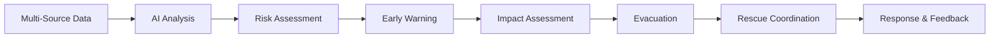

### From Data to Action

| Stage | ResQAI Capability |
|---|---|
| 🌧️ Monitor | Environmental and terrain information |
| 🤖 Predict | AI-based landslide risk assessment |
| 📷 Detect | Visual landslide analysis |
| 🚨 Warn | Risk-based alerts |
| 🏘️ Assess | Population and infrastructure exposure |
| 🛣️ Evacuate | Risk-aware route planning |
| 🚑 Respond | Rescue coordination |
| 📊 Learn | Incident records and feedback |

---

## ✨ Key Features

| Feature | Purpose |
|---|---|
| 🗺️ **Live Risk Map** | Risk zones and spatial intelligence |
| 🤖 **AI Risk Prediction** | Environmental risk analysis |
| 📷 **Visual Analysis** | YOLO11-based image analysis |
| 🚨 **Early Alerts** | Risk-based warnings |
| 🏘️ **Impact Assessment** | Population and infrastructure exposure |
| 🛣️ **Evacuation** | Safer route planning |
| 🚑 **Rescue Operations** | Emergency-team coordination |
| 📋 **Incident Reports** | Disaster documentation |
| 📊 **Response Tracking** | Operational status |

---

# 🧠 AI Intelligence

## 🌧️ Environmental AI

The environmental risk layer can consider:

- Rainfall
- Elevation
- Slope
- Terrain characteristics
- Historical landslide activity
- Soil and geological factors

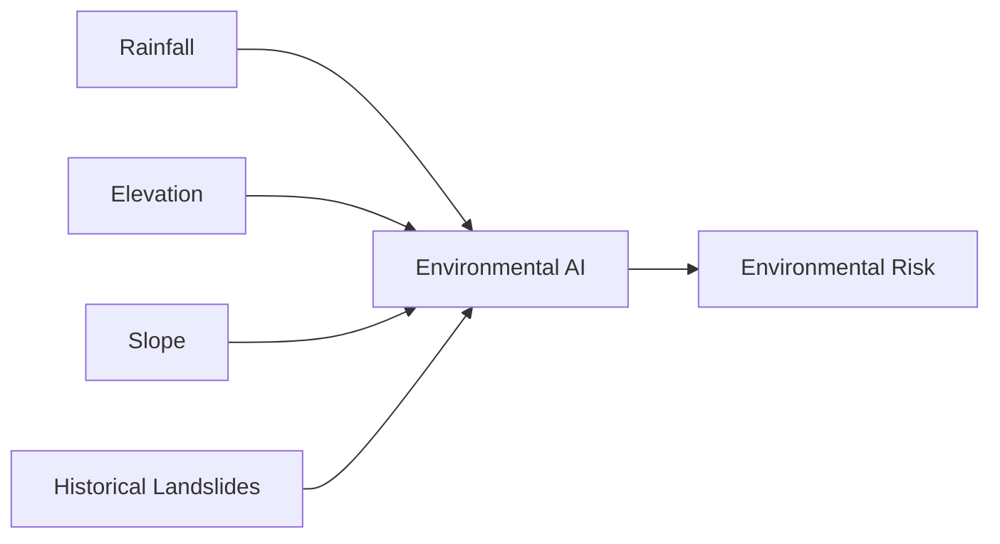

## 📷 Visual AI

Uploaded images can be analyzed using the YOLO11-based visual model.

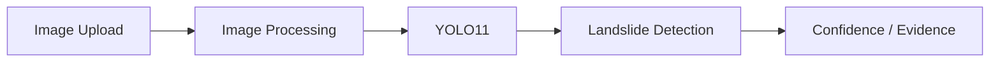

The visual result can act as supporting evidence within the wider risk assessment.

---

# 🔗 Risk Fusion

ResQAI does not rely on a single signal.

Environmental conditions, visual evidence, historical information, and spatial exposure can be combined to support a unified assessment.

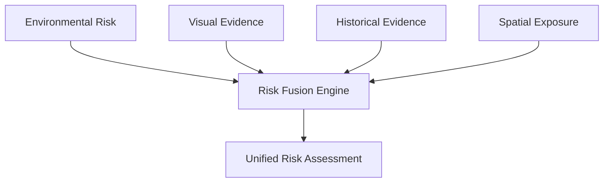

> **Multiple signals → Better-informed emergency decisions**

---

# 🏗️ System Architecture

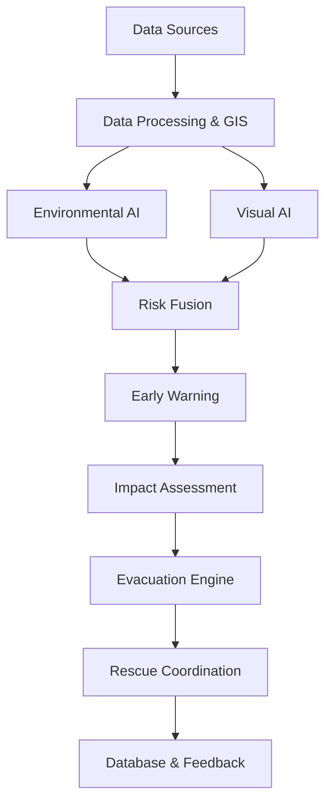

### Architecture Layers

| Layer | Purpose |
|---|---|
| 📡 Data Sources | Environmental, spatial and visual information |
| ⚙️ Data Processing | Clean, integrate and prepare data |
| 🧠 AI Layer | Environmental ML and computer vision |
| 🔗 Risk Fusion | Combine multiple evidence sources |
| 🚨 Warning Engine | Generate risk-based alerts |
| 🏘️ Impact Layer | Estimate exposed people and infrastructure |
| 🛣️ Evacuation | Identify safer routes and zones |
| 🚑 Rescue | Support emergency-team coordination |
| 💾 Feedback | Store incidents, reports and outcomes |

---

# 🗺️ Live Risk Map

The ResQAI map provides a spatial view of disaster intelligence.

### Map Layers

| Layer | Purpose |
|---|---|
| 🔴 Risk Zones | Landslide risk visualization |
| 📍 Active Incidents | Current disaster events |
| 🗻 Historical Landslides | Past landslide locations |
| 🌧️ Rainfall | Rainfall information |
| 🛣️ Roads | Transportation network |
| 🏘️ Settlements | Population areas |
| 🟢 Safe Zones | Potential evacuation areas |
| 🚑 Rescue Teams | Emergency resources |
| 🏥 Critical Infrastructure | Important facilities |

### Location Intelligence

A selected location can provide:

- Risk level
- Risk confidence
- Rainfall
- Slope
- Historical activity
- Population exposure
- Infrastructure exposure
- Recommended actions

---

# 🏘️ Impact Assessment

Once a risk zone is identified, ResQAI can analyze potential exposure.

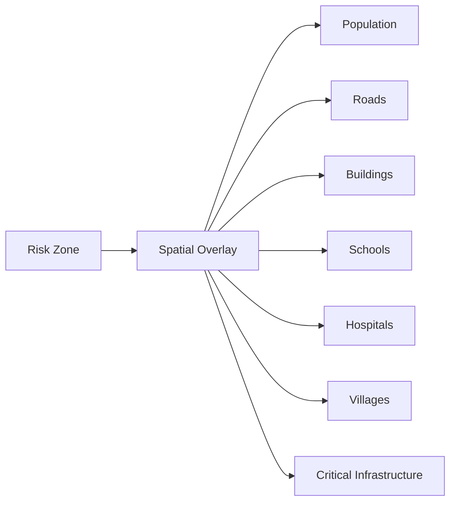

> **From “Where is the risk?” to “What could be affected?”**

---

# 🛣️ Risk-Aware Evacuation

ResQAI is designed to support safer evacuation planning.

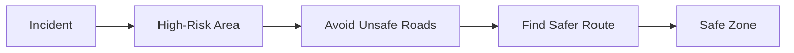

### Route Information

- 📍 Start location
- 🎯 Safe destination
- 🛣️ Route
- 📏 Distance
- ⏱️ Estimated travel time
- ⚠️ Risk areas
- 🚧 Unsafe roads

---

# 🚑 Rescue Coordination

ResQAI extends from risk detection to emergency response.

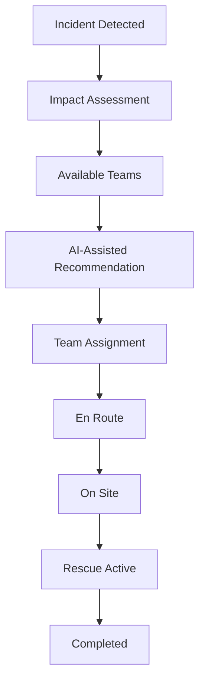

### Rescue Team Status

| Status | Meaning |
|---|---|
| 🟢 AVAILABLE | Ready for deployment |
| 🟡 ASSIGNED | Task assigned |
| 🔵 EN ROUTE | Travelling to incident |
| 🟠 ON SITE | Reached location |
| 🔴 RESCUE ACTIVE | Operation underway |
| ⚫ COMPLETED | Operation finished |

> ResQAI provides **AI-assisted decision support**. Final operational decisions remain with authorized responders.

---

# 🌧️ Early Warning

Example scenario:

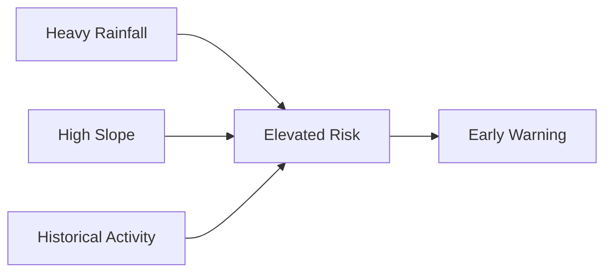

### Risk Levels

| Level | Meaning |
|---|---|
| 🟢 **LOW** | Limited concern |
| 🟡 **MODERATE** | Increased monitoring |
| 🟠 **HIGH** | Action may be required |
| 🔴 **CRITICAL** | Immediate attention |

> Warning thresholds require regional calibration and validation before operational deployment.

---

# 📊 Dashboard

The ResQAI dashboard brings disaster information into one interface.

| Module | Purpose |
|---|---|
| 🗺️ Live Map | Spatial risk intelligence |
| 📊 Risk Monitoring | Environmental risk information |
| 🚨 Alerts | Warning and incident notifications |
| 🏘️ Impact | Exposure assessment |
| 🛣️ Evacuation | Safer route planning |
| 🚑 Rescue | Team coordination |
| 📋 Reports | Incident documentation |

---

# 📚 Research Foundation

ResQAI builds upon established research and disaster-management systems.

| Research / System | Contribution |
|---|---|
| **NASA LHASA** | Global landslide hazard nowcasting |
| **ISRO Landslide Atlas** | Indian landslide inventory |
| **GSI / BhuSanket** | Indian landslide information |
| **Hong Kong Warning System** | Rainfall-based landslide warning |
| **Landslide4Sense** | Satellite landslide detection research |
| **Copernicus EMS** | Emergency mapping and assessment |

### Research → ResQAI

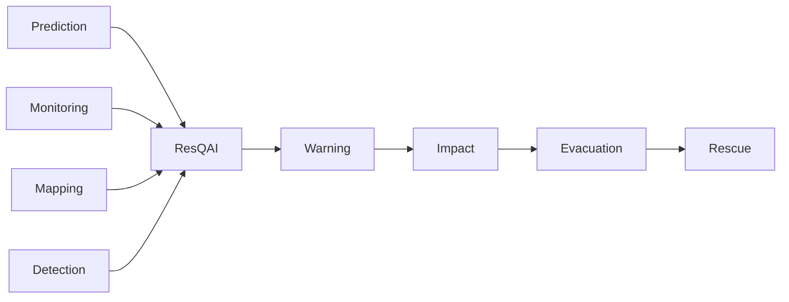

> **ResQAI focuses on connecting prediction and monitoring capabilities with actionable emergency response.**

---

# 🌏 Northeastern India Focus

ResQAI is designed with the **Northeastern Region of India (NER)** in mind.

### Regional Challenges

- ⛰️ Mountainous terrain
- 🌧️ Heavy rainfall
- 🛣️ Vulnerable road corridors
- 🏘️ Remote communities
- 🚑 Difficult emergency access
- 🏗️ Infrastructure exposure

### Regional Vision

> Build a scalable landslide intelligence and emergency-response platform for NER.

---

# 🗃️ Data Sources

| Data | Source | Purpose |
|---|---|---|
| 🗻 Landslide Inventory | [ISRO](https://www.isro.gov.in/Landslide_Atlas_India.html) | Historical events |
| 🧭 Landslide Data | GSI / BhuSanket | Indian validation |
| 🌧️ Rainfall | [NASA GPM / IMERG](https://gpm.nasa.gov/data/imerg) | Precipitation |
| ⛰️ Elevation | [NASA SRTM](https://doi.org/10.5067/MEASURES/SRTM/SRTMGL1.003) | DEM / slope |
| 🛰️ Satellite | [Sentinel-2](https://dataspace.copernicus.eu/data-collections/copernicus-sentinel-missions/sentinel-2) | Spatial analysis |
| 🛣️ Roads | [OpenStreetMap](https://download.geofabrik.de/asia/india.html) | Routing |
| 🏘️ Population | Census / WorldPop | Exposure |
| 📷 Images | Roboflow / Custom Dataset | Visual AI |
| 🧪 Benchmark | [Landslide4Sense](https://github.com/iarai/Landslide4Sense-2022) | Research |

> Some sources represent the planned data pipeline and may not yet be fully integrated into the live prototype.

---

# 🧰 Technology Stack

### Frontend


### Backend


### AI / ML


### Computer Vision


### GIS & Database


### Deployment


---

# 🧪 Model Performance

### Current YOLO11 Visual Model

| Metric | Result |
|---|---:|
| **Precision** | 68.22% |
| **Recall** | 29.17% |
| **mAP@50** | 67.39% |
| **mAP@50–95** | 38.92% |

The current model demonstrates useful detection capability, but its recall indicates that some positive cases may be missed.

Therefore, visual AI is currently treated as **supporting evidence rather than a standalone operational warning system**.

### Planned Improvements

- More regional training data
- Data augmentation
- Improved dataset balance
- Hyperparameter tuning
- Threshold calibration
- Additional validation

---

# ⚙️ Technology Architecture

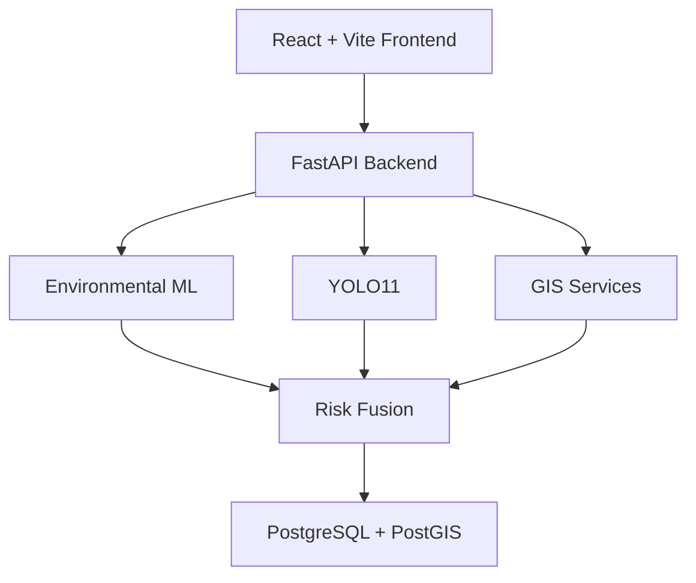

---

# 📁 Repository Structure

```text
AIDISASTER/
├── frontend/
│   ├── src/
│   ├── public/
│   ├── package.json
│   └── vite.config.js
├── backend/
│   ├── app/
│   ├── routes/
│   ├── services/
│   └── requirements.txt
├── model/
│   ├── training/
│   ├── preprocessing/
│   └── model/
├── data/
│   ├── raw/
│   ├── processed/
│   └── sample/
├── database/
├── notebooks/
├── docs/
├── tests/
├── .env.example
├── .gitignore
├── README.md
└── LICENSE
```

---

# 🔌 API Design

| Method | Endpoint | Purpose |
|---|---|---|
| `GET` | `/health` | Backend health |
| `POST` | `/api/risk/predict` | Risk prediction |
| `GET` | `/api/risk/zones` | Risk zones |
| `GET` | `/api/risk/{location_id}` | Location risk |
| `POST` | `/api/vision/analyze` | Image analysis |
| `GET` | `/api/alerts` | Retrieve alerts |
| `POST` | `/api/alerts` | Create alert |
| `GET` | `/api/incidents` | Incidents |
| `POST` | `/api/incidents` | Create incident |
| `GET` | `/api/impact/{incident_id}` | Impact analysis |
| `POST` | `/api/evacuation/route` | Route planning |
| `GET` | `/api/rescue/teams` | Rescue teams |
| `POST` | `/api/rescue/assign` | Assign team |
| `PATCH` | `/api/rescue/{assignment_id}/status` | Update status |
| `GET` | `/api/reports/{incident_id}` | Incident report |

---

# 💻 Installation

### 1. Clone

```bash
git clone https://github.com/rsharma93944-cmyk/AIDISASTER.git
cd AIDISASTER
```

### 2. Frontend

```bash
cd frontend
npm install
npm run dev
```

Frontend runs on:

`http://localhost:5173`

### 3. Backend

```bash
python -m venv venv
```

Windows:

```bash
venv\Scripts\activate
```

Install dependencies:

```bash
pip install -r requirements.txt
```

Run FastAPI:

```bash
uvicorn app.main:app --reload
```

Backend runs on:

`http://127.0.0.1:8000`

---

# 🔐 Environment Configuration

Create a local `.env` file for project configuration.

```env
VITE_API_URL=http://127.0.0.1:8000
DATABASE_URL=your_database_url
MODEL_PATH=path/to/model
```

Never commit:

- `.env`
- API keys
- Passwords
- Private tokens
- Database credentials

Use `.env.example` to document required configuration.

---

# 🗺️ Development Roadmap

### ✅ Prototype

- [x] ResQAI frontend
- [x] Dashboard UI
- [x] Risk monitoring interface
- [x] GIS map interface
- [x] Visual analysis interface
- [x] Alert interface
- [x] Rescue team interface
- [x] Netlify deployment

### 🔄 In Development

- [ ] Backend integration
- [ ] Environmental ML integration
- [ ] Risk fusion engine
- [ ] Live data integration
- [ ] Automated impact assessment
- [ ] Risk-aware routing
- [ ] Rescue coordination backend

### 🔮 Future Scope

- [ ] Real-time satellite integration
- [ ] IoT landslide sensors
- [ ] Weather forecast integration
- [ ] Mobile application
- [ ] SMS alerts
- [ ] Multilingual warnings
- [ ] Drone-based assessment
- [ ] Continuous model improvement

---

# ⚠️ Challenges & Mitigation

| Challenge | Approach |
|---|---|
| Data Scarcity | **Data Fusion** |
| False Alarms | **Risk Fusion** |
| Image Limitations | **Data Augmentation** |
| Real-Time Gaps | **Live Integration** |
| Terrain Complexity | **GIS Analysis** |
| Route Safety | **Risk Routing** |
| Model Generalization | **Regional Validation** |
| Response Complexity | **AI Assistance** |

---

# 🌱 Impact

| Benefit | Contribution |
|---|---|
| 🛡️ Early Warning | Supports timely awareness of elevated risk |
| 🚑 Faster Response | Provides structured response information |
| 🛣️ Safer Evacuation | Helps identify safer routes |
| 🏘️ Community Protection | Helps understand exposed communities |
| 📊 Better Planning | Supports evidence-based decisions |
| 🌏 Regional Scalability | Designed for NER-focused deployment |

---

# 🧠 Responsible AI

ResQAI is designed as a **decision-support platform**, not an autonomous emergency authority.

### Principles

- Human oversight
- Confidence-aware predictions
- Regional validation
- Data-quality monitoring
- Transparent decision support
- Responsible use of AI

> AI recommendations should assist trained emergency personnel rather than replace authorized human decisions.

---

# 🚧 Project Status

### 🟢 ACTIVE DEVELOPMENT

**Hackathon / Research Prototype**

The project combines a working frontend prototype with ongoing development of AI, backend, GIS, and emergency-response components.

Some architecture elements represent the planned target system and may not yet be fully integrated into the live deployment.

---

# 🏆 Why ResQAI?

Many disaster systems focus on individual capabilities such as:

**Monitoring → Prediction → Mapping → Detection → Response**

ResQAI connects these capabilities into one workflow:

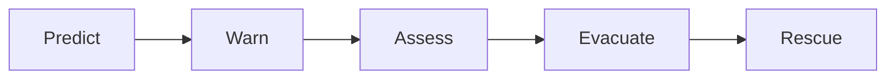

### Core Differentiator

> **From predicting landslide risk to coordinating the response — in one integrated system.**

---

# 🔮 Vision

We envision disaster management moving from:

**Reactive → Informed → Predictive → Proactive**

ResQAI aims to turn available disaster data into **timely, location-aware, and actionable emergency intelligence**.

---

# 🔗 Important Links

| Resource | Link |
|---|---|
| 🌐 Live Demo | [ResQAI](https://aidisaster-detector.netlify.app/) |
| 💻 GitHub Repository | [AIDISASTER](https://github.com/rsharma93944-cmyk/AIDISASTER) |
| 🛰️ ISRO Landslide Atlas | [ISRO](https://www.isro.gov.in/Landslide_Atlas_India.html) |
| 🌧️ NASA GPM / IMERG | [NASA](https://gpm.nasa.gov/data/imerg) |
| ⛰️ NASA SRTM | [SRTM](https://doi.org/10.5067/MEASURES/SRTM/SRTMGL1.003) |
| 🛰️ Copernicus Sentinel-2 | [Copernicus](https://dataspace.copernicus.eu/data-collections/copernicus-sentinel-missions/sentinel-2) |
| 🗺️ OpenStreetMap Data | [Geofabrik](https://download.geofabrik.de/asia/india.html) |
| 🧪 Landslide4Sense | [GitHub](https://github.com/iarai/Landslide4Sense-2022) |

---

# 🌍 ResQAI

### **Nature Warns. We Act.**

**Predict • Warn • Protect • Respond**

**[🚀 Open Live Demo](https://aidisaster-detector.netlify.app/)**

**[💻 View Source Code](https://github.com/rsharma93944-cmyk/AIDISASTER)**

---

⭐ **Star the repository** if you find ResQAI useful.

🍴 **Fork the project** and explore the implementation.

💡 **Suggestions and contributions are welcome.**
